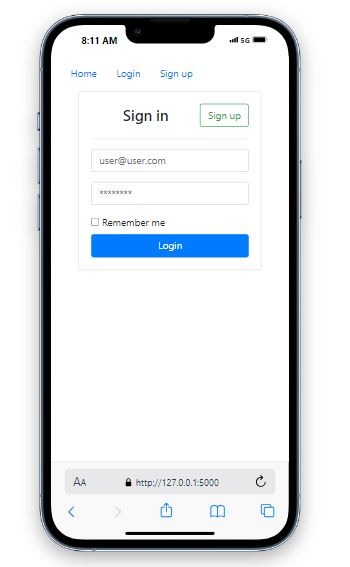
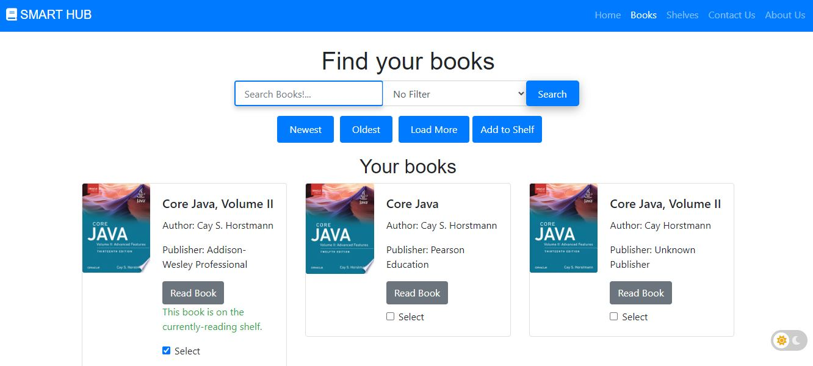
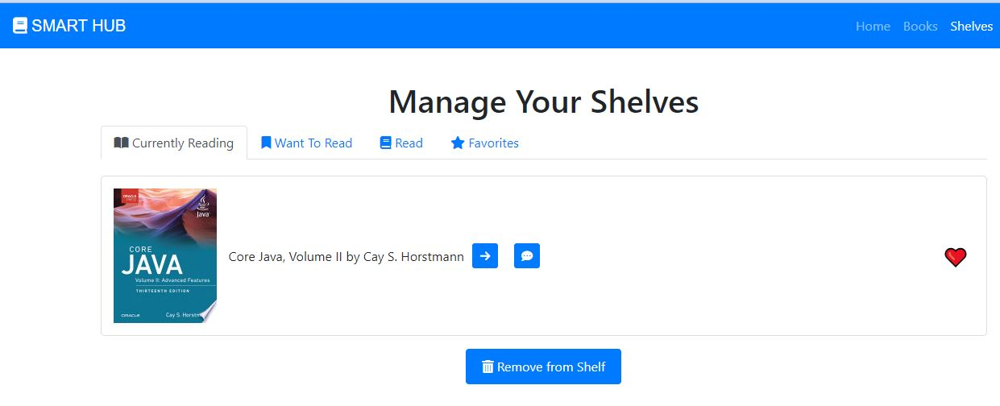
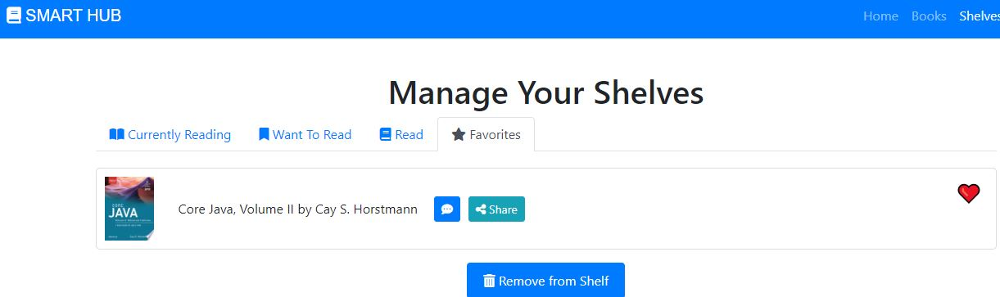

# Smart Hub:

## Introduction
Smart Hub is your go-to online library for exploring amazing books and resources. We provide a comprehensive platform where you can browse a vast collection of books, create your own virtual bookshelf, and embark on new reading adventures. Built with HTML, CSS, JavaScript, and Flask (Python), Smart Hub offers a user-friendly interface and robust functionality.

## Author(s)
- [REEM ALFADIL ABD ALLAH](https://github.com/reemelfadilhassanin) 

## Demo

### Login:



### Singup:


### banner section:


### books:



### shelves:



### Favorit shelves:



## Installation
To get a local copy up and running, follow these steps:

1. Clone the repository:
   ```bash
   git clone https://github.com/yourusername/smart-hub.git
2. Install environment: 

```bash
     python3 -m pip install --user --upgrade pip
     python3 -m pip install --user virtualenv
     python3 -m venv env

Enable virtual environment: source env/bin/activate 

Install packages: pip install -r requirements.txt


3. Run the app:

.\env\Scripts\activate  # For Windows

Python

from project import create_app
 
app = create_app()
 
app.run()  # This should start the Flask development server


